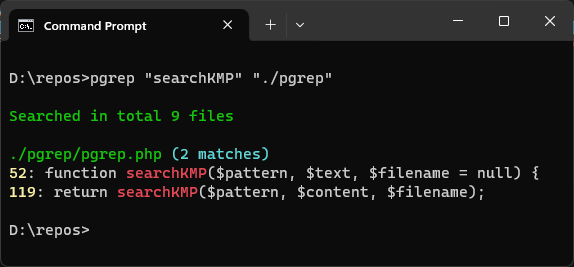

# PGREP - A PHP Application using the Knuth-Morris-Pratt Algorithm

## Description

This is a PHP application that uses the Knuth-Morris-Pratt algorithm to search for a pattern in file or directories.

## Requirements

- PHP 7.4 or higher

## Installation

- Windows
  - Clone this repository
  - Just add repository folder to your PATH

## Usage

- Windows

  - Open a command prompt
  - `pgrep 'hello world' /path/to/file.txt`
  - `pgrep 'hello world' /path/to/directory`